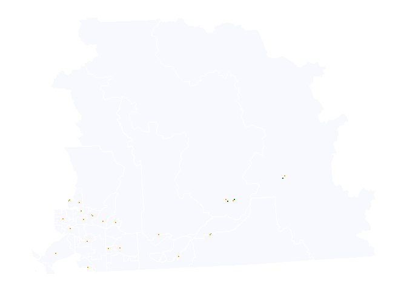

<!-- README.md is generated from README.Rmd. Please edit that file -->

# offsetpointbc

<!-- badges: start -->
<!-- badges: end -->

The goal of offsetpointbc is to offset point data to help maintain
confidentiality. The package is designed for BC data projected to a
meters based crs like crs 3005 (NAD 1983 / BC Albers) (default) or crs
26910 (NAD83 / UTM zone 10).

Appreciation and acknowledgement goes to Sunny Mak from BCCDC who
provided resources and offsetting (geomasking) methodology.

Offsetting methodology:

- x offset formula: x’ = x0 + RandDist \* cos(RandAngle)
- y offset formula: y’ = y0 + RandDist \* sin(RandAngle)

Key Background:

- code relies on sf package for spatial data manipulation.

- A point and polygon object in a meters based crs compatible for BC
  data (crs 3005 or 26910) is required. The polygon boundary layer
  ensures offset points remain within the area of interest (example, use
  bcmaps::health_chsa())

- Important: if possible, in the polygon boundary layer, include a
  column with total population for each boundary (ex link to BC Stats’
  PEOPLE data).

  - Offsetting is most appropriately done when using the average
    distance between people within a given area. This is estimated by
    the square root of the inverse of population density.
  - From this, we generate a minimum offset (1 to 2 times the average
    distance, 1 is used in this function) and a maximum offset (3 to 5
    times the average distance, 3 is used in this function)

- Note: During data preparation, before using this function, consider
  excluding cases in low population areas.

## Installation

You can install the development version of offsetpointbc like so:

``` r
devtools::install_github("https://github.com/zoealavi/offsetpointbc")
```

## Example

This is a basic example on how to run the function:

``` r
library(offsetpointbc)

pacman::p_load(dplyr,
               janitor,
               bcmaps,
               ggplot2,
               ggthemes,
               sf,
               knitr
)

# Boundary Layer ---------------------------------------------
boundary_chsa <- bcmaps::health_chsa() %>%
  clean_names() %>% 
  select(cmnty_hlth_serv_area_code,
         cmnty_hlth_serv_area_name,
         chsa_population_census, ## census population data comes with bcmaps::health_chsa() layer
         local_hlth_area_code,
         local_hlth_area_name,
         hlth_service_dlvr_area_code,
         hlth_service_dlvr_area_name,
         hlth_authority_code,
         hlth_authority_name,
         feature_area_sqm,
         feature_length_m
         ) %>% 
  filter(hlth_authority_code == "2") %>% ## filtering to Fraser Health only
  mutate(cmnty_hlth_serv_area_code = as.numeric(cmnty_hlth_serv_area_code))
#> health_chsa was updated on 2026-01-27

# Point Layer (to offset) ---------------------------------------------
point_bc_cities <- bcmaps::bc_cities() %>% 
  clean_names() %>% 
  select(id,
         fcode,
         bcmj_tag,
         name,
         long_type) %>% 
  filter(lengths(sf::st_within(., boundary_chsa)) > 0) ## keep cities within Fraser Health only

# Apply Function ------------------------------------------------------------
offset_pop_density <- offset_points_within_boundary(
  sf_point_data = point_bc_cities,
  sf_boundary = boundary_chsa,
  sf_boundary_id_col = "cmnty_hlth_serv_area_code", 
  sf_boundary_id_col_new_name = "chsa",
  sf_boundary_total_pop_col = "chsa_population_census", ## polygon data contains population data so offsetting will be based off of population density
  crs_code = 3005 #default or can use 26910
)

# Visualize ------------------------------------------------------------
ggplot(data = boundary_chsa) + ## create a base layer
  
  ## adjust base layer (grey)
  geom_sf(lwd = .5,
          fill = "ghostwhite",
          color = "white") +
  
  ## original point data
  geom_sf(data = point_bc_cities,
          shape = 21,
          colour = "white",
          fill = "green4") +
  
  ## offset point data
  geom_sf(data = offset_pop_density,
          shape = 21,
          colour = "white",
          fill = "orange") +
  
  theme_map()
```



# Function output:

| id                                               | fcode      | bcmj_tag | name                 | long_type             | min_ave_dist | max_ave_dist | chsa_original | x_original | y_original |  rand_dist | rand_angle | x_offset | y_offset | geometry                 | chsa_offset | chsa_corrected | offset_boundary_match_original |
|:-------------------------------------------------|:-----------|---------:|:---------------------|:----------------------|-------------:|-------------:|--------------:|-----------:|-----------:|-----------:|-----------:|---------:|---------:|:-------------------------|------------:|---------------:|:-------------------------------|
| WHSE_BASEMAPPING.BC_MAJOR_CITIES_POINTS_500M.52  | AR08750000 |       52 | Hope                 | DISTRICT MUNICIPALITY |    833.47486 |   2400.42459 |          2110 |    1331330 |   495251.2 | 1474.53847 |        114 |  1332244 | 496408.6 | POINT (1332244 496408.6) |        2110 |           2110 | TRUE                           |
| WHSE_BASEMAPPING.BC_MAJOR_CITIES_POINTS_500M.53  | AR05500000 |       54 | Abbotsford           | CITY                  |     96.16909 |    188.50727 |          2132 |    1279162 |   456226.8 |  147.74089 |        299 |  1279036 | 456149.7 | POINT (1279036 456149.7) |        2132 |           2132 | TRUE                           |
| WHSE_BASEMAPPING.BC_MAJOR_CITIES_POINTS_500M.54  | AR08750000 |       55 | Langley (District)   | DISTRICT MUNICIPALITY |    137.46812 |    312.40435 |          2316 |    1249824 |   460260.4 |  175.28801 |         65 |  1249726 | 460405.4 | POINT (1249726 460405.4) |        2316 |           2316 | TRUE                           |
| WHSE_BASEMAPPING.BC_MAJOR_CITIES_POINTS_500M.55  | AR05500000 |       56 | Langley (City)       | CITY                  |     68.78651 |    106.35952 |          2311 |    1244230 |   460036.7 |   93.07919 |        172 |  1244164 | 460102.6 | POINT (1244164 460102.6) |        2311 |           2311 | TRUE                           |
| WHSE_BASEMAPPING.BC_MAJOR_CITIES_POINTS_500M.56  | AR05500000 |       57 | Surrey               | CITY                  |     68.00867 |    104.02602 |          2335 |    1233373 |   463621.2 |   92.07422 |          1 |  1233422 | 463698.7 | POINT (1233422 463698.7) |        2335 |           2335 | TRUE                           |
| WHSE_BASEMAPPING.BC_MAJOR_CITIES_POINTS_500M.57  | AR05500000 |       58 | White Rock           | CITY                  |     65.28276 |     95.84827 |          2342 |    1233991 |   450637.3 |   93.46664 |        292 |  1233899 | 450653.0 | POINT (1233899 450653)   |        2342 |           2342 | TRUE                           |
| WHSE_BASEMAPPING.BC_MAJOR_CITIES_POINTS_500M.58  | AR08750000 |       59 | Delta                | DISTRICT MUNICIPALITY |    128.79572 |    286.38717 |          2322 |    1217710 |   457463.0 |  169.74284 |        266 |  1217623 | 457609.0 | POINT (1217623 457609)   |        2322 |           2322 | TRUE                           |
| WHSE_BASEMAPPING.BC_MAJOR_CITIES_POINTS_500M.60  | AR05500000 |       61 | New Westminster      | CITY                  |     61.12023 |     83.36068 |          2213 |    1225039 |   470051.4 |   63.29925 |        143 |  1225043 | 469988.2 | POINT (1225043 469988.2) |        2213 |           2213 | TRUE                           |
| WHSE_BASEMAPPING.BC_MAJOR_CITIES_POINTS_500M.81  | AR08750000 |       82 | Maple Ridge          | DISTRICT MUNICIPALITY |     70.23893 |    110.71678 |          2231 |    1247698 |   473072.6 |   70.25487 |         15 |  1247645 | 473118.3 | POINT (1247645 473118.3) |        2231 |           2231 | TRUE                           |
| WHSE_BASEMAPPING.BC_MAJOR_CITIES_POINTS_500M.82  | AR08750000 |       83 | Mission              | DISTRICT MUNICIPALITY |    330.43979 |    891.31937 |          2142 |    1268959 |   466918.3 |  640.86771 |         87 |  1269324 | 466391.6 | POINT (1269303 466834.3) |        2141 |           2142 | TRUE                           |
| WHSE_BASEMAPPING.BC_MAJOR_CITIES_POINTS_500M.83  | AR08750000 |       84 | Pitt Meadows         | DISTRICT MUNICIPALITY |    120.50926 |    261.52778 |          2232 |    1241264 |   473632.1 |  135.61557 |         99 |  1241270 | 473496.6 | POINT (1241270 473496.6) |        2232 |           2232 | TRUE                           |
| WHSE_BASEMAPPING.BC_MAJOR_CITIES_POINTS_500M.84  | AR05500000 |       85 | Port Coquitlam       | CITY                  |     73.69988 |    121.09963 |          2244 |    1236005 |   476541.4 |   83.99754 |         87 |  1236053 | 476472.3 | POINT (1236053 476472.3) |        2244 |           2244 | TRUE                           |
| WHSE_BASEMAPPING.BC_MAJOR_CITIES_POINTS_500M.85  | AR05500000 |       86 | Coquitlam            | CITY                  |     75.46945 |    126.40836 |          2243 |    1231753 |   474639.2 |   91.07788 |         47 |  1231663 | 474650.4 | POINT (1231663 474650.4) |        2243 |           2243 | TRUE                           |
| WHSE_BASEMAPPING.BC_MAJOR_CITIES_POINTS_500M.86  | AR05500000 |       87 | Port Moody           | CITY                  |     70.99830 |    112.99489 |          2245 |    1230578 |   478947.2 |  101.81859 |        350 |  1230549 | 478849.5 | POINT (1230549 478849.5) |        2245 |           2245 | TRUE                           |
| WHSE_BASEMAPPING.BC_MAJOR_CITIES_POINTS_500M.112 | AR32700000 |      113 | Harrison Hot Springs | VILLAGE               |    675.87384 |   1927.62153 |          2150 |    1307023 |   484628.0 |  880.75481 |        180 |  1306496 | 483922.4 | POINT (1306496 483922.4) |        2150 |           2150 | TRUE                           |
| WHSE_BASEMAPPING.BC_MAJOR_CITIES_POINTS_500M.113 | AR08750000 |      114 | Kent                 | DISTRICT MUNICIPALITY |    675.87384 |   1927.62153 |          2150 |    1303583 |   483597.0 | 1254.60025 |         59 |  1302616 | 484395.9 | POINT (1302616 484395.9) |        2150 |           2150 | TRUE                           |
| WHSE_BASEMAPPING.BC_MAJOR_CITIES_POINTS_500M.114 | AR05500000 |      115 | Burnaby              | CITY                  |     74.34215 |    123.02644 |          2223 |    1221196 |   474747.0 |   85.33895 |        238 |  1221258 | 474688.1 | POINT (1221258 474688.1) |        2223 |           2223 | TRUE                           |
| WHSE_BASEMAPPING.BC_MAJOR_CITIES_POINTS_500M.115 | AR32700000 |      116 | Belcarra             | VILLAGE               |    103.84781 |    211.54343 |          2246 |    1224503 |   484028.0 |  182.12852 |        127 |  1224545 | 484205.1 | POINT (1224545 484205.1) |        2246 |           2246 | TRUE                           |
| WHSE_BASEMAPPING.BC_MAJOR_CITIES_POINTS_500M.116 | AR32700000 |      117 | Anmore               | VILLAGE               |    103.84781 |    211.54343 |          2246 |    1229427 |   483010.0 |  115.19005 |        208 |  1229518 | 483080.2 | POINT (1229518 483080.2) |        2246 |           2246 | TRUE                           |
| WHSE_BASEMAPPING.BC_MAJOR_CITIES_POINTS_500M.166 | AR05500000 |       53 | Chilliwack           | CITY                  |    188.60755 |    465.82266 |          2121 |    1295079 |   467199.6 |  276.38604 |        236 |  1294822 | 467097.0 | POINT (1294822 467097)   |        2121 |           2121 | TRUE                           |

# Visualize offsetting

- Green is original point location
- Orange is offset location


